# SourceTree로 배우는 Git 튜토리얼

## Git이란 무엇인가?

<https://velog.io/@euisuk-chung/1.-%EA%B9%83Git%EC%9D%B4%EB%9E%80>

깃(Git)은 소프트웨어 개발에서 사용되는 분산 버전 관리 시스템입니다. 
즉, 여러 명이 하나의 프로젝트를 개발할 때, 소스코드의 변경 내역을 추적하고 관리하여 버전을 관리할 수 있는 도구입니다.
 

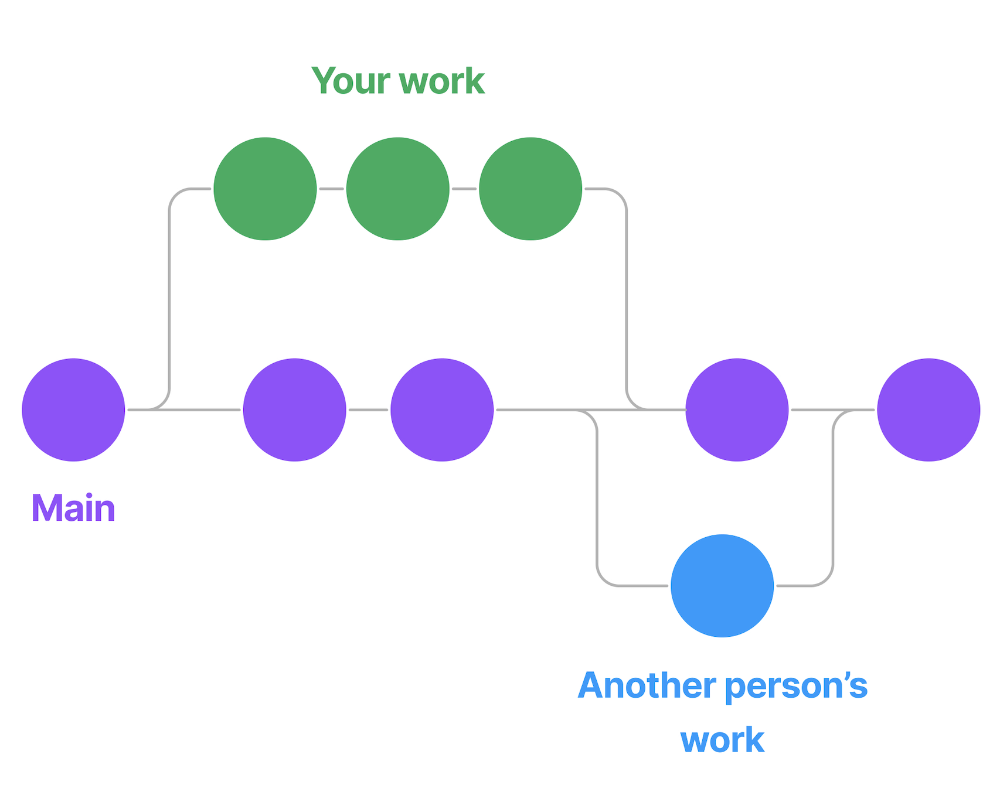
 

## Git의 주요 개념

- **Repository(저장소)**: 깃에서는 변경 내역을 추적하고 관리하는 단위로, 일반적으로 로컬 저장소와 원격 저장소로 나뉩니다. 로컬 저장소는 개발자의 개발 환경에서 사용되는 저장소이며, 원격 저장소는 다른 개발자와 협업할 때 사용되는 저장소입니다.

- **Commit(커밋)**: 변경 내역을 저장소에 기록하는 작업을 의미합니다. 각각의 커밋은 변경 내역의 이력을 추적할 수 있습니다.

- **Branch(브랜치)**: 커밋의 이력을 기반으로 생성된 작업 라인으로, 새로운 기능 추가나 버그 수정 등을 위해 독립적인 브랜치를 생성하여 작업할 수 있습니다.

## SourceTree 설치

소스트리를 이용해서 Git 사용법을 익혀봅시다. 

참조: <https://saakmiso.tistory.com/15>

# SourceTree에서 GitHub 계정 연결

<https://saakmiso.tistory.com/126>

(Windows 환경) 

소스트리를 시작하고 상단 메뉴에서 원격 저장소( Remote ) 항목으로 이동한다.

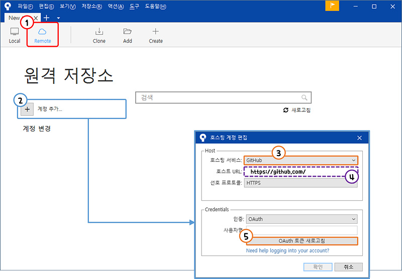

[ + 계정 추가 ] 버튼을 클릭하면 '호스트 계정 편집' 팝업창이 오픈된다. 
호스팅 서비스를 'GitHub' 로 변경하면 호스트 URL이 자동으로 https://github.com/ 으로 변경된다.  
 
마지막으로 Credentials의 [ OAuth 토큰 새로 고침 ] 버튼을 클릭한다. 
 
 
그럼 브라우저가 실행되고 GitHub 페이지로 이동하게 된다.

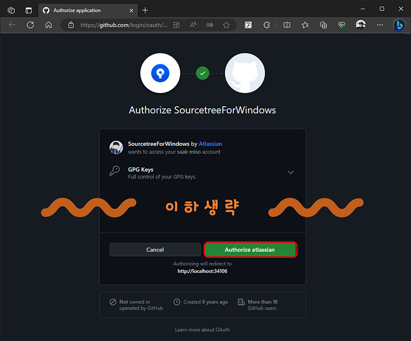

Authoriza atlassian을 클릭한다.

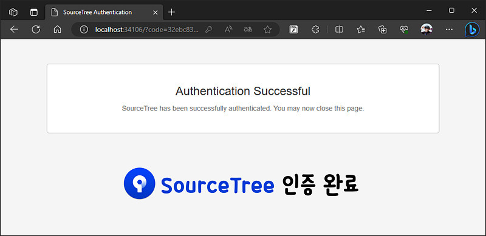

그럼 GitHub 계정과 SourceTree 사용에 대한 인증이 완료되었음을 알리는 페이지로 이동한다.

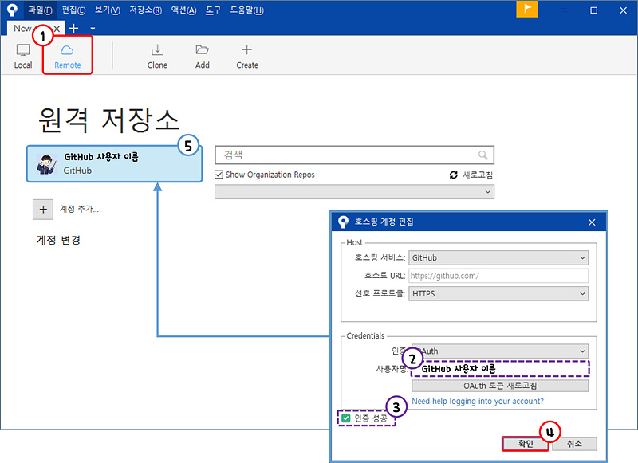

다시 소스트리로 돌아와서 '호스팅 계정 편집' 팝업창에 
사용자 명에 GitHub 사용자 이름이 추가되고 "인증 성공" 이라고 뜨면 [확인] 버튼을 클릭한다. 
 
그럼 원격 저장소( Remote )에 GitHub 계정이 연동되는 것을 확인 할 수 있다. 
 

# SourceTree에 원격 저장소 복제( Clone )하기

소스트리( SourceTree )를 실행하고 상단 Clone 메뉴를 선택한다.

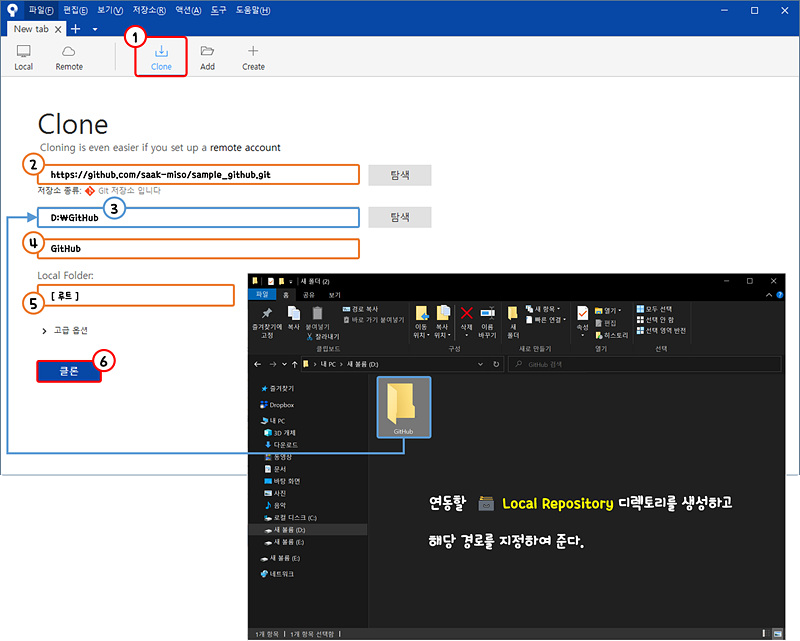 

GitHub에서 생성한 원격 저장소의 내용을 복제할 로컬 저장소를 생성하고 해당 경로를 기입한다. 
 
[클론] 버튼을 클릭하여 레파지토리를 로컬 저장소로 복제한다.
 

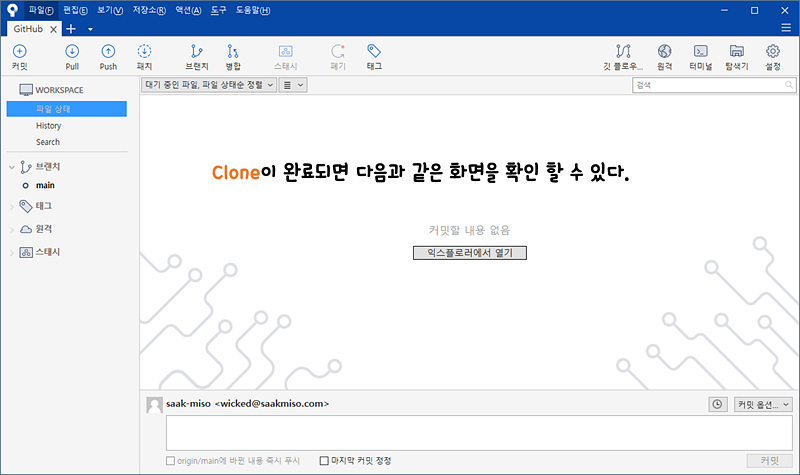

 
 

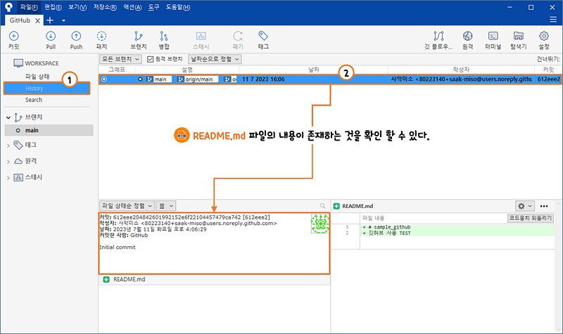

좌측 카테고리의 History를 선택하면 GitHub 저장소를 생성하면서 같이 생성한 README.md 파일이 존재한다. 

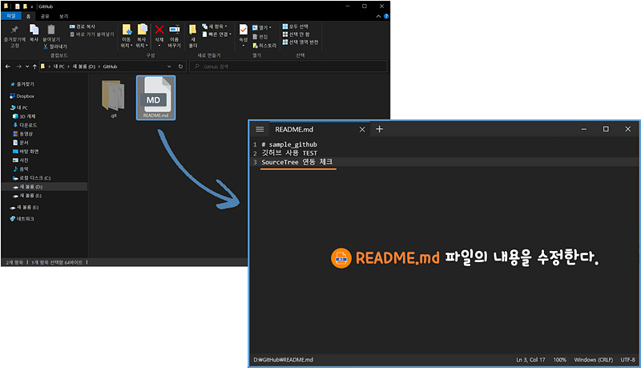

로컬 저장소의 경로로 이동하면 .git( 숨김폴더 )와 README.md 파일이 추가된 것을 확인 할 수 있다. 
 
README.md 파일을 열고 내용을 가볍게 수정해 준다.
( *Visual Studio Code같은 코드 에디터를 사용하면 편하다.)

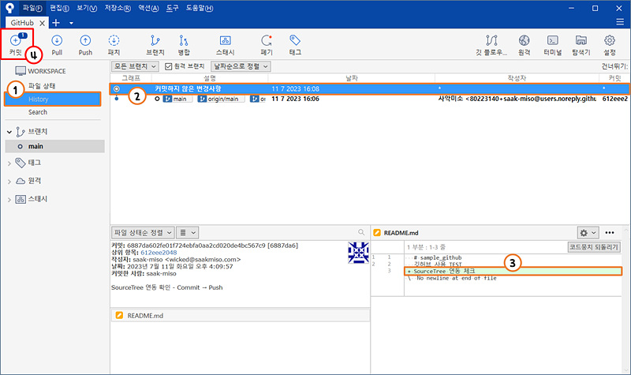

파일을 수정한 후,  
다시 소스트리를 확인하면 History 목록에 '커밋하지 않은 변경사항'이 추가된 것을 확인 할 수 있다.

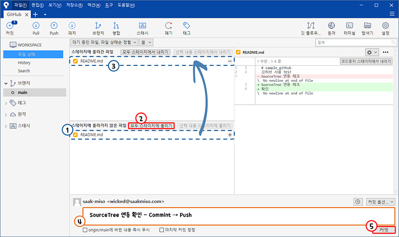

 
위와 같이 변경된 사항을 확인 하였다면 상단 좌측의 [커밋] 메뉴를 클릭하여 준다. 
  
스테이지에 올라가지 않은 파일을 보면 README.md 파일이 존재한다. 
 
 
README.md 파일을 생성하고 [모두 스테이지에 올리기] 버튼을 클릭하여 준다. 
 

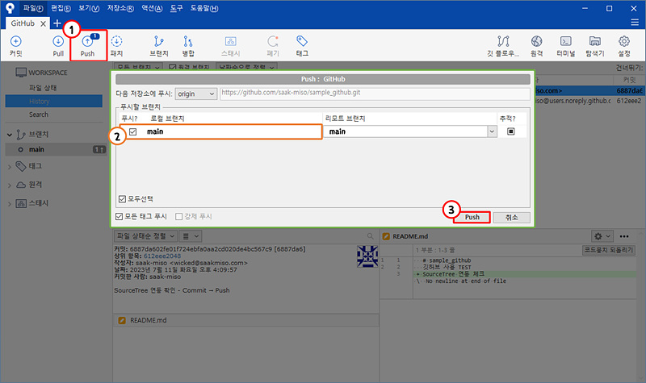

 
README.md 파일이 스테이지에 올라가면 다음으로 커밋 메시지를 작성해 주어야 한다. 
 
( 커밋 메시지는 구체적으로 입력하는 것이 좋다. ) 
 
  
커밋 메시지를 작성한후 [커밋] 버튼을 클릭한다. 
 

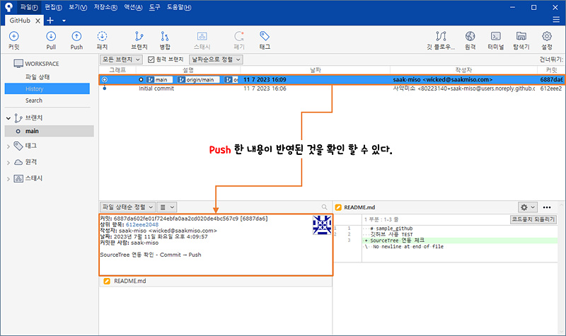

 
커밋에 성공하면 바로 커밋한 내용을 Push( 원격 저장소에 반영 )할지 여부를 묻는다. 
 
로컬 브랜치를 선택하고 [Push] 버튼을 클릭하여 저장소에 반영한다. 
 

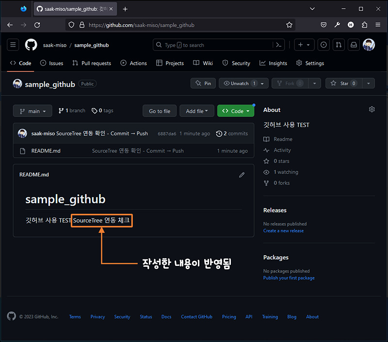

 
이제 다시 GitHub 사이트로 돌아와서 생성한 원격 저장소를 다시 살펴보면 
README.md 파일에 변경한 내용이 반영된 것을 확인 할 수 있다. 